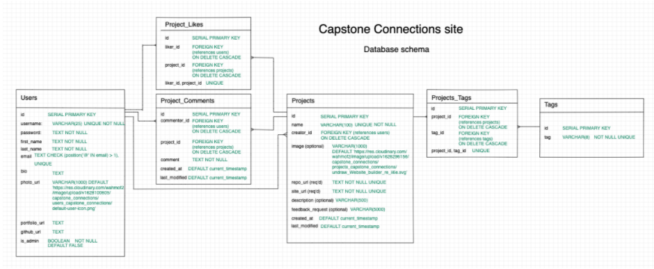

# Capstone Connection API

## Database Schema

## API methods

### users
* GET "users/" = requires admin. Retrieves list of all users and their information
* GET "users/id" = requires authentication. Retrieves detailed information of user. 
* POST "users/" = Registers a new user. 
